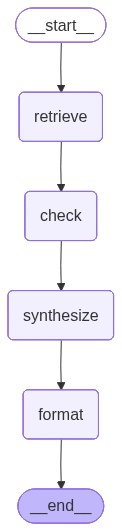

# RAG-QA

## Problem Statement
A multi-country B2B retail platform that serves structured content — Terms of Service, FAQs, Promotional Banners, Product Announcements, and Static Pages — across multiple countries and languages. The current system relies on exact-match lookups (type + country + language), forcing customers to manually search through long documents or contact support when they have specific questions. To improve this system we add a natural-language Q&A layer on top of that structred content: given a question, a country, and a language, it retrieves the most relevant content chunks that belong exclusively to that country, synthesize a grounded answer using an LLM, and returns verifiable citations that point back to the exact source documents — guaranteeing that no customer ever receives an answer grounded in another country's rules, even if those rules are semantically very similar.


## Architecture Diagram




## Prerequisites
1. Python 3.11
2. Docker
3. API KEY for LLM


## Clone and install the project

Clone:

```bash
git clone https://github.com/rsinda/rag-qa.git
cd rag-qa
python -m venv .venv && source .venv/bin/activate
```

Run below shell script given that you have all the above Prerequisites met.

```bash
bash setup.sh
```

Sample Request:

```
curl -X 'POST' \
  'http://localhost:8000/ask' \
  -H 'accept: application/json' \
  -H 'Content-Type: application/json' \
  -d '{
  "question": "How do I close my account?",
  "country": "D",
  "language": "en"
}'
```

Sample Response:

```
{
    "answer": "You can close your account by sending a closure request to support by email. The closure will take effect within 5 business days. Any outstanding invoices must be paid before closure is finalized.",
    "language_used": "en",
    "citations": [
        {
            "content_id": "d_faq_account_en",
            "type": "FAQ",
            "excerpt": "Send a closure request to support by email. Closure takes effect within 5 business days....",
            "match_score": 0.738,
            "original_language": "en"
        },
        {
            "content_id": "d_tc_en_v1",
            "type": "TERMS_AND_CONDITIONS",
            "excerpt": "These terms apply to customers in Country D. You must be a registered business ...",
            "match_score": 0.2801,
            "original_language": "en"
        }
    ],
    "trace": {
        "retrieval_count": 3,
        "graded_relevant": 3,
        "fallback_used": false,
        "latency_ms": 12414,
        "model": "gemini-2.5-flash"
    }
}
```

## Ingestion Pipeline:
Its already in `setup.sh` script, but if you want to run it for a different file:
 
```bash
source .venv/bin/activate
python ingestion_pipeline/ingest.py --corpus_file_path corpus.jsonl
```

## Eval Harness

To run eval harness first make sure your API is up.

```bash
bash setup.sh
```

Then in a new terminal

```bash
source .venv/bin/activate
python eval_harness.py
```


## Unit Test:

```bash
source .venv/bin/activate
pytest tests -v
```

## Known Limitations:

1. Need better chuncking strategy, right now each item embedded as one chunk.
2. Need better Retriver with hybrid search.
3. No caching.
4. Synchronous only.

## What I Would Do Next:

1. Improve chunking with overlapping chunking strategy.
2. Structured LLM output, to avoid response parsing failure.
3. Self-Rag with rewrite query.
4. Better multimodel support in Retriver, sentence transformer is not state-of-the-art.
5. Incremental ingestion and de-duplication
6. Better Abstraction for LLM provides, to switch between different vendor easily.